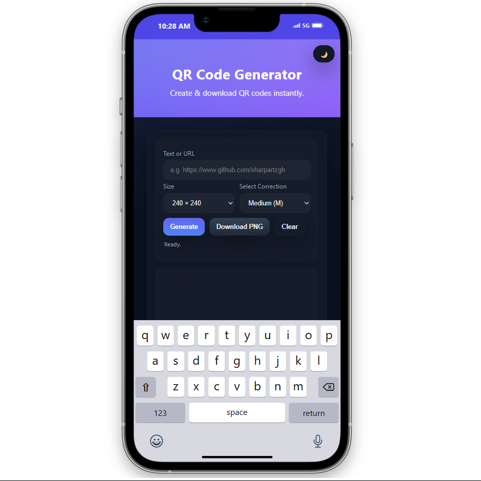

# Free QR Code Generator

A fast, clean, and free **QR Code Generator** built with vanilla **HTML, CSS, and JavaScript**.  
Create QR codes instantly for URLs, text, and more — then download them as PNG files.

## ✨ Features
- 🔗 Generate QR codes for any text or URL  
- 📏 Adjustable sizes (160px – 400px)  
- 🎯 Custom error correction levels (L, M, Q, H)  
- 🌙 Light/Dark mode toggle (saved in localStorage)  
- 📥 Download QR codes as PNG images  
- ⚡ Works offline (no backend required)

## 🚀 Live
👉 [Live](https://sharpartzgh.github.io/Qrcode-Generator/)  

## 📖 Usage

- Enter text or a URL in the input field

- Select QR code size and error correction level

- Click Generate

- Download your QR code as a PNG or clear to start over

## 📷 Screenshot

- Mobile

- Desktop

## 🔧 Technologies

- HTML5

- CSS3 (Vanilla, responsive)

- JavaScript (ES6+)

-  library for QR rendering [QRCode.js](https://github.com/davidshimjs/qrcodejs)

## Built with ❤️ by Sharpartzgh.

© 2025 Sharpartzgh. All rights reserved.
