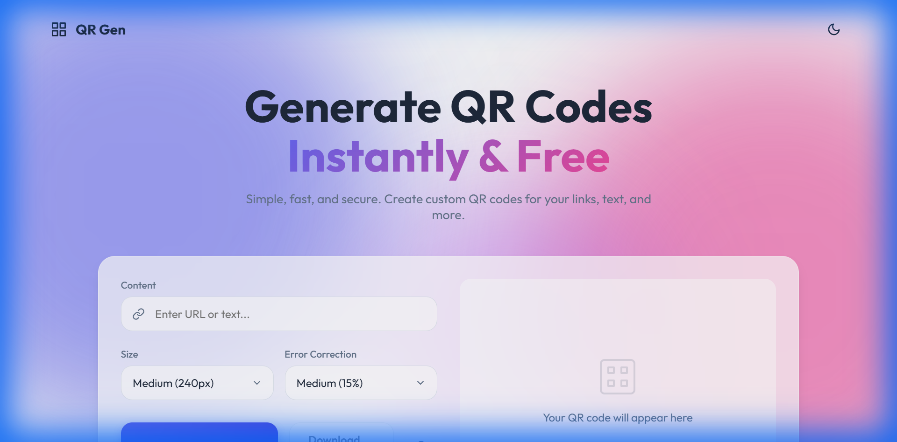
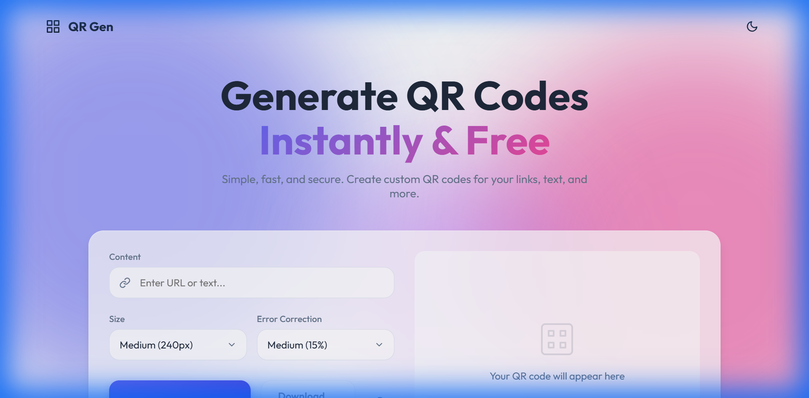
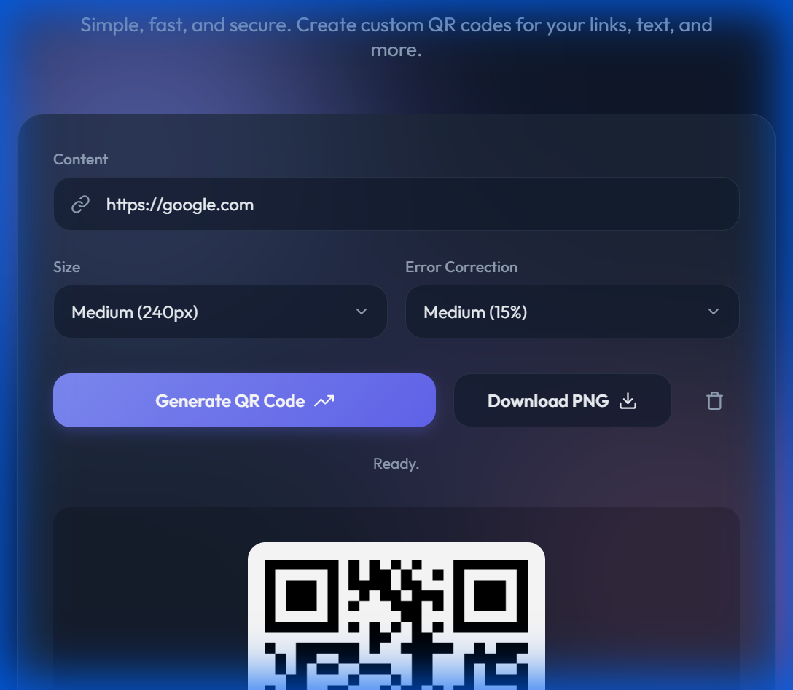

# QR Gen - Premium QR Code Generator

A fast, modern, and free **QR Code Generator** featuring a stunning glassmorphism design.  
Create custom QR codes instantly for URLs, text, and more — then download them as PNG files.

## ✨ Features
- 🎨 **Modern UI/UX**: Glassmorphism aesthetic with vibrant gradients and smooth animations.
- 🌓 **Dark/Light Mode**: Seamless theme switching with persistent preference.
- 📱 **Fully Responsive**: Optimized for all devices, from mobile to desktop.
- ⚡ **Instant Generation**: Real-time QR code creation using `QRCode.js`.
- 📥 **High-Quality Downloads**: Export your QR codes as PNG images.
- 🛠 **Customizable**: Adjust size (160px – 400px) and error correction levels.

## 🚀 Live Demo
👉 [Launch App](index.html)

## � Screenshots

### Light Mode
The default view features a bright, airy design with soft shadows and a colorful background.

### Dark Mode
Sleek, high-contrast interface that is easy on the eyes.

### Generated QR Code
Smooth pop-in animation for generated codes.

## 🔧 Technologies
- **HTML5**: Semantic structure.
- **CSS3**: Vanilla CSS with custom properties (variables) for theming and glassmorphism.
- **JavaScript**: ES6+ for logic and DOM manipulation.
- **Library**: [QRCode.js](https://github.com/davidshimjs/qrcodejs) for QR rendering.
- **Font**: [Outfit](https://fonts.google.com/specimen/Outfit) from Google Fonts.

## 📖 Usage
1. **Enter Content**: Type your URL or text in the input field.
2. **Customize**: Select your preferred size and error correction level.
3. **Generate**: Click the "Generate QR Code" button.
4. **Download**: Save your QR code as a PNG file.

## Built with ❤️ by Sharpartzgh.

© 2025 Sharpartzgh. All rights reserved.
